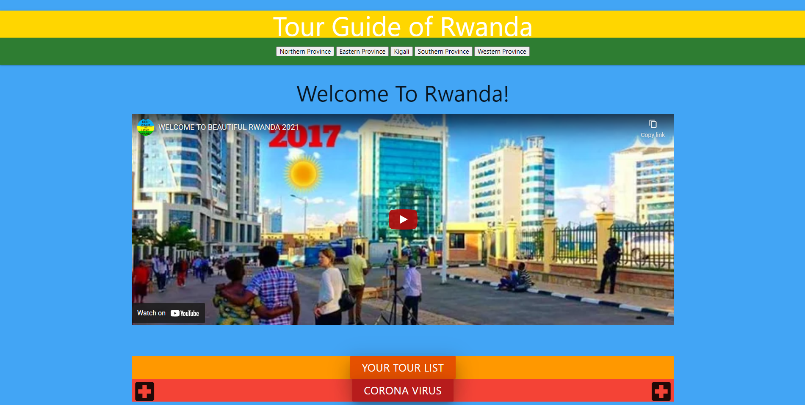

# A-Tour-Guide-Of-Rwanda
A website showcasing various travel locations in the country of Rwanda. Inside this website you will find Major cities of Rwanda an places 
of Attraction within them. There are many dining options we've selected and several places to vist. We also give you facts about the religious
and art history.

## The following APIs were used in this project.
https://rapidapi.com/victorkarangwa4/api/rwanda - 
https://covid-19.dataflowkit.com/

## Here is a picture of the deployed homepage 

## These are the links to the github repo and the deployed URL
GitHub repo: https://github.com/JamesHardin02/A-Tour-Guide-Of-Rwanda
URL: https://jameshardin02.github.io/A-Tour-Guide-Of-Rwanda/
